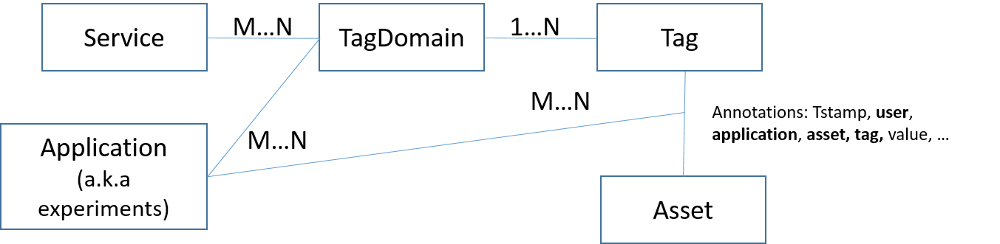

# Asset-Annotation-Service

## General Information
Data annotation service is a service for storing annotations/taggings of
Organicity Assets. It is possible experimenters to define a set of 
labels under the scope of the experiment and then collect annotation 
on data assets from the participants. 
 
- Annotation Service Endpoint: http://annotations.organicity.eu:8084/ 
- Annotation Service Swagger UI: http://annotations.organicity.eu:8084/swagger-ui.html 
- Annotation Service Swagger Documentation: https://organicityeu.github.io/api/Annotation.html 
 
## Data Model

Data Model Entities: 

## Annotation Service API

Operations:
- TagDomain Management: Service, TagDomain, Tag
- Application Management: Application, TagDomain 
- Annotations: Asset, Tag 

User Roles:
- OC Admin (OC-A)
- OC Experimenter (OC-E)
- OC Participant (OC-P)
- OC Anonymous (OC-AN)

Restricions at Operations (v1):
1. TagDomain Management
+ OC-A can CRUD on Service, TagDomain, Tag
+ OC-E, OC-P, OC-AN can R on Service, TagDomain, Tag
2. Application Management
+ OC-E can CRUD on Application, TagDomain
3. Annotation
+ OC-A can CRUR all Annotations 
+ OC-E can CRUR all annotations of his applications
+ OC-P can CRUD only his annotations
+ OC-AN can R only COUNT aggregations of annotations

## Sample Calls
